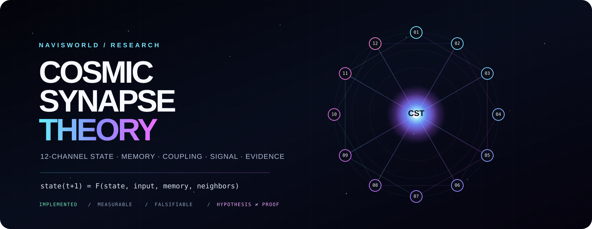

<div align="center">



# COSMIC SYNAPSE THEORY // CST

### A computational research program for higher-dimensional state, persistent memory, signal-driven dynamics, and synaptic-style interaction

**Not a slogan. Not a claim of solved physics. A system you can inspect, run, measure, break, and improve.**

[](#scientific-boundary)
[](CST_Formula_Explanation.markdown)
[](#run-the-original-simulator)
[](#what-is-implemented-here)
[](https://doi.org/10.5281/zenodo.17574447)

**[OPEN THE INTERACTIVE CST FIELD](index.html)** · **[READ THE 2026 THEORY MAP](docs/CST_2026.md)** · **[CHECK THE CLAIM LEDGER](docs/CLAIMS_AND_EVIDENCE.md)**

</div>

---

## The idea in one sentence

**CST asks whether a system can become more useful when it is modeled not as isolated steps, but as a living field of state whose components continuously influence one another through memory, signal, distance, recurrence, and learned association.**

The original repository explored that idea as a cosmic simulation. Later CST work turned the same design language into reusable software primitives for persistent state, Hebbian-style association, event routing, cross-language synaptic computation, model adapters, sensory summaries, and reproducible experiments.

This repository is the **origin layer** of that program. It preserves the early simulator, documents what the math means, repairs the missing runtime pieces, and clearly separates the implemented software from the larger physical hypothesis.

---

## See it before you read it

`index.html` is a self-contained browser visualization of a CST-style 12-channel field. It needs no framework, no build system, and no external assets.

Open it locally:

```bash
python -m http.server 8000
```

Then visit `http://localhost:8000`.

The visualization includes:

- 12 continuously evolving state channels
- dynamic node coupling and synaptic links
- entropy and Lyapunov-style instability indicators
- signal-to-color mapping
- deterministic reseeding
- an optional microphone-reactive mode that processes amplitude locally in the browser
- an explicit separation between **visual proxy metrics** and the repository's historical CST equations

Nothing from microphone mode is uploaded by this page.

---

## What CST is

CST is best understood as **three layers that must not be confused with one another**.

| Layer | Meaning | Status |
|---|---|---|
| **Computational architecture** | Persistent state, coupled channels, memory, signal transforms, recurrent dynamics, synaptic-style affinity, routing | Implemented across the CST software family |
| **Simulation model** | Cosmic entities represented as interacting nodes in an 11D/12D numerical state space and projected into a 3D visual environment | Implemented here as a research simulation |
| **Physical hypothesis** | The universe may admit a useful neural-network-like description in which information and interaction behave analogously to synapses | Speculative and unproven |

The strongest version of CST is the one that survives this separation. Software can work even when a physical interpretation remains unverified.

---

## What is implemented here

The repository contains an early but substantial end-to-end simulator:

### Python simulation core

- `cst_engine.py`
  - entity creation and evolution
  - 11-dimensional position and velocity vectors in the legacy simulator
  - a 12-value internal memory vector
  - Lyapunov-style divergence measurement
  - gravitational and distance-based interaction terms
  - entropy evolution
  - CST `psi` calculation
  - frequency-to-light color mapping
  - CSV and JSON memory-node logging
  - SHA-256 token chaining

- `ecosystem_engine.py`
  - repaired 2026 runtime dependency
  - supplies the `add_ecosystem`, `update`, and `export` interface already expected by `cst_engine.py`
  - intentionally remains a bounded simulation component, not a biology claim

- `socket_server.py`
  - local TCP transport
  - `ping`, `update`, and `audio` commands
  - Unity-facing JSON state export

- `cst_functions.py`
  - later 12D informational-energy-density formulation
  - 12D position and velocity arrays
  - gravitational, synaptic, chaotic, and informational terms
  - optional Web3 helper path retained from the CosmoChain experiment

### Unity-side runtime

The C# files provide the visual/client side of the earlier simulation, including:

- `CSTClient.cs`
- `CosmicEngine.cs`
- `MicAnalyzer.cs`
- `MeshGenerator.cs`
- `PlanetFactory.cs`
- `ShaderGenerator.cs`
- `ProceduralMaterialGenerator.cs`
- `AtmosphereGenerator.cs`
- `MemoryRift.cs`
- `NPCBehavior.cs`

These files are source components rather than a complete checked-in Unity project folder. The original simulation architecture is documented in [`docs/ARCHITECTURE.md`](docs/ARCHITECTURE.md).

---

## The CST equation

The repository contains two historical stages of the math.

### Legacy simulator potential

The original engine computes a normalized potential from total energy, a Lyapunov-style term, path length, interaction strength, and gravitational potential:

```text
psi = (phi*E + lambda*E*dt + L*m*c^2/scale + Omega*E/a0 + Ugrav) / V_11D
```

That equation is implemented directly in `CSTEntity.compute_psi()`.

### 12D formulation

The later formulation in `CST_Formula_Explanation.markdown` and `cst_functions.py` expands the model into a 12D state representation with four broad components:

```text
psi_i = ( kinetic_i + synaptic_i + gravitational_i + informational_i ) / V_12D
```

The exact expanded expression and variable definitions are preserved in [`CST_Formula_Explanation.markdown`](CST_Formula_Explanation.markdown).

**Important:** the 12 dimensions are computational state-space coordinates in this code. Their existence in the simulator is not evidence that physical spacetime literally has twelve dimensions.

---

## From the original simulator to the wider CST stack

CST no longer exists as one formula in one simulation. The public research program now includes reusable implementations that make the underlying ideas testable outside the cosmic visualization.

### CST Libraries

[`NavisWORLD/Python-cst-libraries-`](https://github.com/NavisWORLD/Python-cst-libraries-)

A cross-language SDK with Python, C, C++, Rust, JavaScript/TypeScript, Go, Java, Kotlin, C#, and Swift paths for persistent state, Gaussian synaptic affinity, gated blending, Hebbian association, memory, event routing, model adapters, CST-L, and conformance vectors.

### COSMOS / CST Universe Manual

[`NavisWORLD/Volume-I-The-COSMOS-CST-Universe-Manual.`](https://github.com/NavisWORLD/Volume-I-The-COSMOS-CST-Universe-Manual.)

The public manual and reproducible memory implementation. It documents durable semantic memory, recursive consolidation, Planetary Memory namespaces, heartbeat-driven software cadence, evidence rules, teacher material, and the foundational CST DOI.

### Foundational deposit

**Cory Shane Davis, _12-Dimensional Cosmic Synapse Theory_, Zenodo**  
DOI: **10.5281/zenodo.17574447**

A DOI provides a persistent scholarly reference. It does not by itself validate the physical hypothesis or establish patent rights.

---

## Run the original simulator

### 1. Clone

```bash
git clone https://github.com/NavisWORLD/The-theory-of-CST.git
cd The-theory-of-CST
```

### 2. Create an environment

```bash
python -m venv .venv
```

Activate it:

```bash
# macOS / Linux
source .venv/bin/activate

# Windows PowerShell
.venv\Scripts\Activate.ps1
```

### 3. Install

```bash
python -m pip install -U pip
pip install -r requirements.txt
```

Linux users may need the system PortAudio development package before PyAudio can build.

### 4. Start in deterministic mock-audio mode

```bash
MOCK_AUDIO=1 python socket_server.py
```

Windows PowerShell:

```powershell
$env:MOCK_AUDIO="1"
python socket_server.py
```

The default local endpoint is `127.0.0.1:5555`.

Protocol examples:

```text
ping
update
audio {"rms":0.42,"pitch":440.0}
```

Each command is newline-delimited.

---

## Verification

Install dev dependencies and run:

```bash
pip install -r requirements-dev.txt
MOCK_AUDIO=1 PYTHONPATH=. pytest -q
```

The CI workflow performs the same smoke path on supported Python versions.

The verification suite currently checks:

- the repaired ecosystem interface
- bounded ecosystem state
- compatibility with the frequency-array shape used by the simulator
- importability of the Python stack
- engine startup and `ping()` under mock audio

---

## Evidence rule

Every CST claim should be tagged mentally, and ideally in writing, as one of these:

| Label | Definition |
|---|---|
| **IMPLEMENTED** | Code exists and can be inspected |
| **OBSERVED** | A captured runtime shows the code executed |
| **MEASURED** | A declared experiment produced a metric |
| **NULL** | A test failed its declared success criterion |
| **HYPOTHESIS** | A falsifiable proposition awaiting evidence |
| **MODEL / METAPHOR** | Useful conceptual language that is not itself literal physics or biology |

See [`docs/CLAIMS_AND_EVIDENCE.md`](docs/CLAIMS_AND_EVIDENCE.md) for the repository-specific ledger.

---

## Scientific boundary

This repository **does not establish** that:

- the universe is literally a biological neural network
- simulation theory has been proven
- twelve physical dimensions have been experimentally discovered
- a golden-ratio term is a fundamental law of nature
- the informational term is a new physical force
- CST produces unhackable biometrics
- CST provides medical diagnosis
- persistent software state is consciousness
- a simulation variable is automatically a physical observable

What the repository **does** establish is narrower and more useful: it contains executable attempts to turn a large speculative idea into explicit state variables, equations, signal transforms, interaction rules, memory structures, network transport, visual outputs, and falsifiable software experiments.

That is where serious evaluation starts.

---

## Repository map

```text
.
├── README.md
├── index.html                         interactive CST field
├── cst_engine.py                      legacy simulation runtime
├── cst_functions.py                   12D formulation + CosmoChain helpers
├── ecosystem_engine.py                repaired ecosystem dependency
├── socket_server.py                   local TCP bridge
├── CST_Formula_Explanation.markdown   full historical 12D derivation
├── *.cs                               Unity/client simulation components
├── docs/
│   ├── CST_2026.md                    modern theory map
│   ├── ARCHITECTURE.md                software/data-flow architecture
│   └── CLAIMS_AND_EVIDENCE.md         claim ledger and falsification rules
├── tests/
│   ├── test_ecosystem_engine.py
│   └── test_smoke.py
├── requirements.txt
├── requirements-dev.txt
├── CITATION.cff
└── .github/workflows/ci.yml
```

---

## If you only read three files

1. **[`docs/CST_2026.md`](docs/CST_2026.md)** to understand the idea without mythology.
2. **[`docs/CLAIMS_AND_EVIDENCE.md`](docs/CLAIMS_AND_EVIDENCE.md)** to see exactly what is and is not being claimed.
3. **[`cst_engine.py`](cst_engine.py)** to inspect the original mechanism instead of taking anyone's word for it.

---

## Rights and reuse

This repository contains material from different moments in its history, including files that may carry their own earlier license text. The repository-level rights notice is [`CORY_DAVIS_IP_AND_ACCESS_NOTICE.md`](CORY_DAVIS_IP_AND_ACCESS_NOTICE.md).

That notice expressly preserves third-party rights and any rights validly granted under earlier licenses for earlier copies or versions. Always inspect the specific file and applicable history before assuming a reuse right.

---

<div align="center">

### CST is strongest when the strange idea is made measurable.

**Read the code. Run the model. Break the assumptions. Keep the evidence.**

</div>
