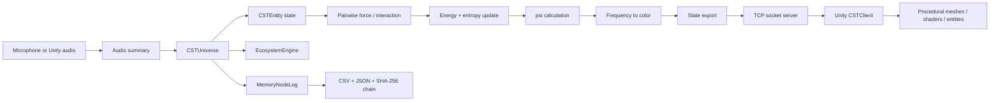

# CST Legacy Simulator Architecture

## System view



## Python data flow

### Startup

`socket_server.py` constructs `CSTEngine`, which constructs `CSTUniverse`.

`CSTUniverse` initializes:

- entity storage;
- audio processing;
- frequency-to-light logging;
- `MemoryNodeLog`;
- `EcosystemEngine`;
- ten initial entities.

### Update cycle

A client sends:

```text
update\n
```

The engine then:

1. reads local audio or the most recent Unity audio summary;
2. optionally spawns a new entity;
3. updates toy ecosystem state for planet entities;
4. builds or refreshes a KD-tree over entity positions;
5. computes local pairwise forces;
6. updates velocity, position, chaotic energy, entropy, and age;
7. exports entities whose position/time threshold changed;
8. computes Lyapunov-style divergence, path length, interaction strength, gravitational potential, and `psi`;
9. maps frequency and state values into RGB;
10. records log/token state;
11. serializes JSON for the client.

## Socket protocol

The protocol is newline-delimited text.

### Ping

Request:

```text
ping
```

Response:

```json
{"status":"ok","entities":10}
```

### Update

Request:

```text
update
```

Response: JSON array of exported entity objects.

### Audio

Request:

```text
audio {"rms":0.42,"pitch":440.0}
```

Response:

```json
{"status":"ok"}
```

## Entity schema

The exported representation contains:

```text
id
mass
position[3]
velocity[3]
psi
entropy
frequency
entity_type
ecosystem_level
mesh_params
shader_params
texture_params
lyapunov_exponent
path_length
synaptic_strength
gravitational_potential
ecosystem_data
```

The simulator maintains more internal dimensions than it exports visually. The client receives a 3D projection for rendering.

## Ecosystem compatibility layer

The historical engine already referenced an `EcosystemEngine` but the file was absent from the repository. The 2026 repair adds the exact interface the engine expects:

```python
add_ecosystem(entity)
update(entities, audio_data, dt)
export(entity_id)
```

The implementation keeps all values bounded in `[0, 1]` and labels itself as a toy simulation mechanism rather than a biological model.

## Unity-side components

The root C# source files cover several responsibilities:

- `CSTClient.cs`: network client and state ingestion;
- `CosmicEngine.cs`: entity creation/update and main scene behavior;
- `MicAnalyzer.cs`: microphone/audio measurements;
- `MeshGenerator.cs`: procedural mesh generation;
- `PlanetFactory.cs`: planet construction;
- `ShaderGenerator.cs`: shader/material behavior;
- `ProceduralMaterialGenerator.cs`: generated surface material parameters;
- `AtmosphereGenerator.cs`: atmosphere effects;
- `MemoryRift.cs`: trail/particle-style memory visualization;
- `NPCBehavior.cs`: behavior logic.

This repository contains the source components, not a complete Unity project with all scene and asset metadata.

## Architectural limitations worth knowing

The legacy simulator intentionally remains visible as historical code. Important constraints include:

- a large monolithic `cst_engine.py`;
- heavy scientific/audio dependencies;
- console logging on hot paths;
- simplified force and ecosystem models;
- a local TCP protocol without authentication because it binds to loopback by default;
- a mixture of 11D legacy state and 12D later formulation;
- simulation constants chosen for experimentation rather than calibrated astrophysical prediction.

Those limitations are part of the evidence record, not something to hide.

## Relationship to later CST architecture

Later public CST repositories extract the reusable ideas from this simulation into cleaner modules:

```text
persistent state
+ semantic memory
+ Hebbian association
+ synaptic affinity
+ event routing
+ sensory summaries
+ provenance
+ model adapters
+ cross-language conformance
```

The legacy simulator is therefore best read as the origin of the design language rather than the final form of the software stack.
